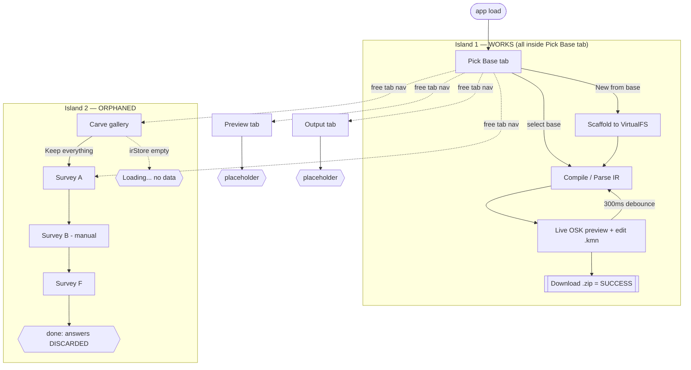
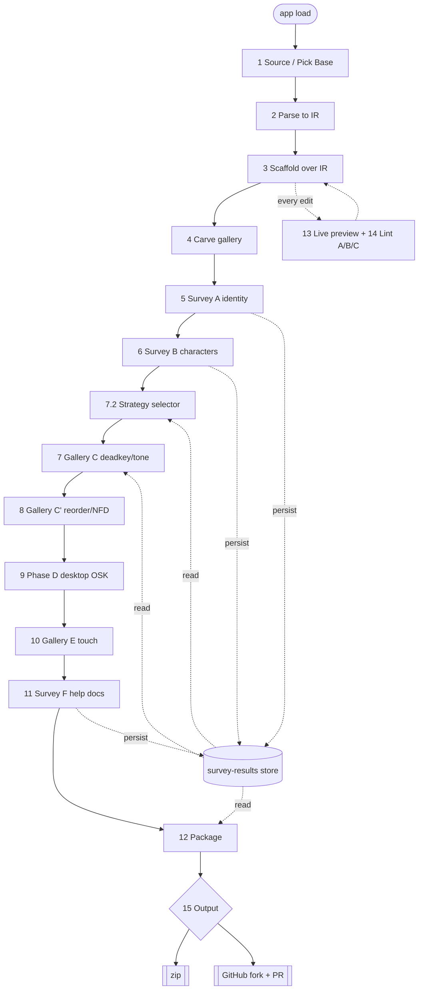

# Workflow models — pre-hybrid (HISTORICAL)

**Status:** ARCHIVED — superseded 2026-06-14.

These models represent two intermediate stages of the studio's authoring-flow design:
Model 1 is the "as-built" two-island state of the SPA before the hybrid flow was
adopted; Model 2 is the intermediate "intended" model derived from spec §8 before the
hybrid ordering was ratified. Both are retained for provenance only.

The adopted flow is the **hybrid ordering**, documented in
[docs/workflow-model.md](../workflow-model.md) and authoritative in
[spec.md](../../spec.md) §8 (v1.2.0 + v1.3.0). Do not treat the models below as
current.

---

## Model 1 — EXISTING flow (as built)

Two disconnected islands plus free tab-hopping. Dead-ends marked `{{...}}`.

The whole survey/gallery island feeds nothing; `SS`/`GC`/`GCp`/`PD`/`GE` do not
exist as nodes yet.

---

## Model 2 — INTENDED flow (spec §8, pre-hybrid)

One spine, with Preview+Lint as a continuous side-channel and a persisted
survey-results store feeding the strategy stages.

---

## Overlay — intermingle worksheet

Where the two models diverge. This was the surface on which the hybrid ordering
decision was made.

| Edge / element | Existing | Intended | Note for intermingling |
|---|---|---|---|
| `SCF -> PV -> ZIP` loop | present (Island 1) | present (side-channel + terminal) | **The one thing both agree on.** The spine to graft onto. |
| `SRC -> IR -> SCF` ordering | collapsed into one tab | explicit sequence | keep one screen, or split? |
| `SCF -> CARVE` | absent (CARVE orphaned) | present | first missing weld |
| `SA/SB/SF -> STORE` | absent (discarded) | present | **prerequisite for every weld below** |
| `STORE -> SS -> GC/GCp` | nodes absent | present | substantive new build |
| `SB -> SS` (inventory -> strategy) | absent | present | this is the "gallery for extra keys" |
| free tab-nav (any -> any) | present | gated sequence | keep free nav, gate, or hybrid? |
| `OUT -> PR` | absent (zip only) | present | output-tab work |

**Structural insight.** Both models contain the same `Scaffold -> Preview/Lint ->
Output` loop. In the build it is the *entire* flow; in the spec it is the
*bookends*, with steps 4–11 spliced *between* scaffold and output and the preview
loop running throughout. So intermingling is: **decide what sequence of
survey/gallery nodes to splice into the middle of an already-working scaffold->output
spine, and route the survey-results store as the data bus.** A survey-first variant
is just relocating `SA` ahead of `SRC` and adding a `SA -> suggest-base -> SRC`
edge — a re-wiring of the same node set, not a new graph.
