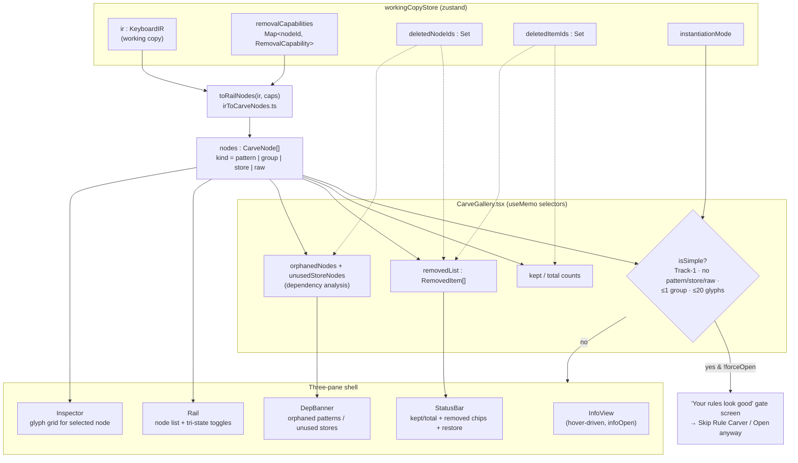
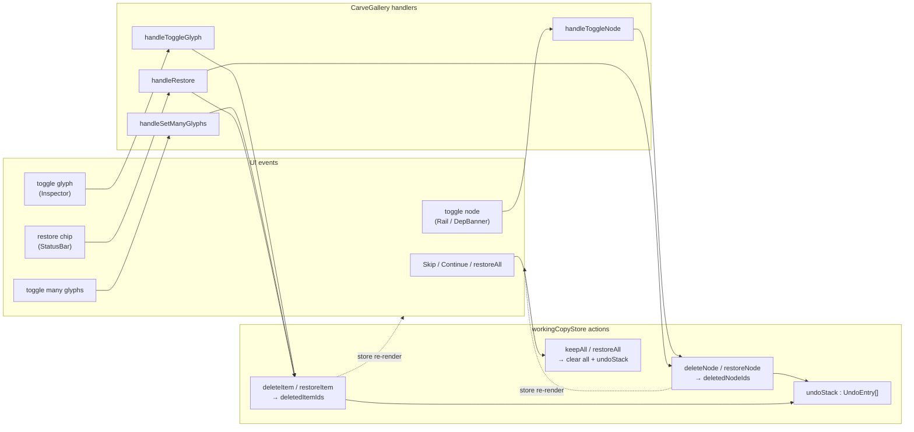
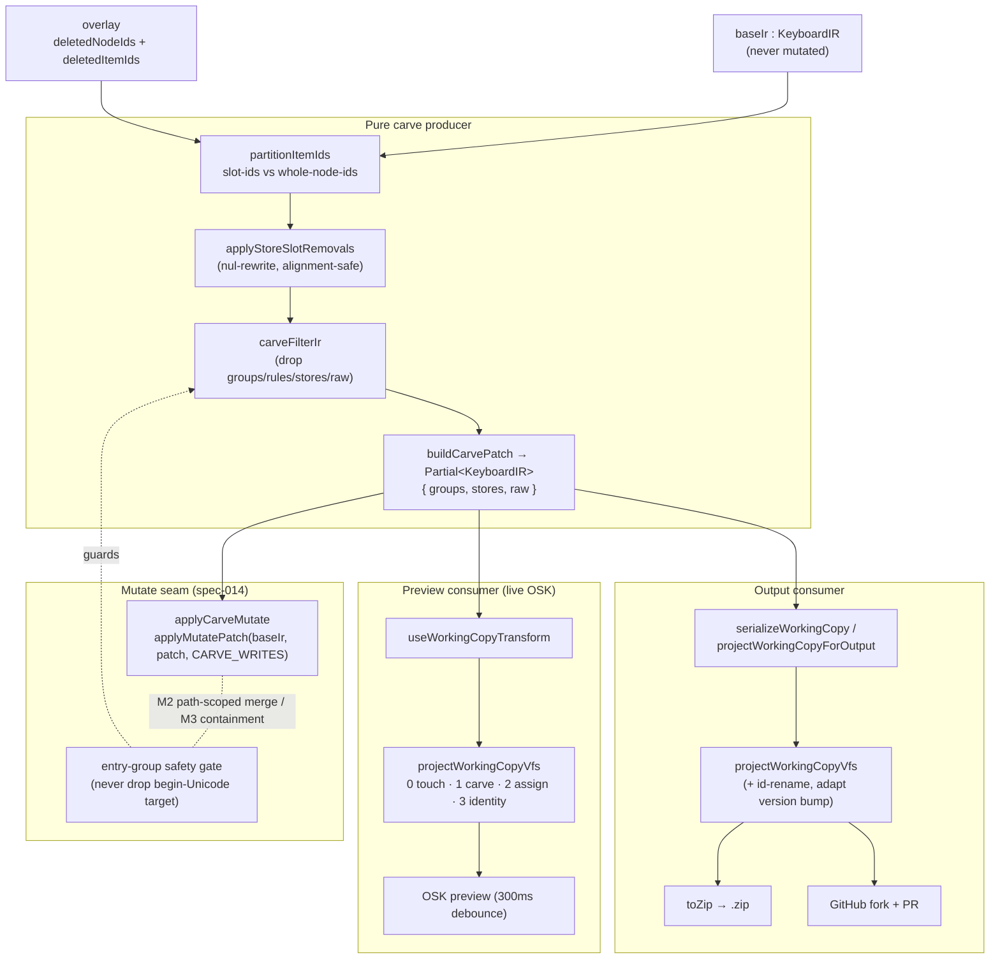

# Carve Gallery — workflow & data-flow map

> Phase D of the authoring spine: *"Review your keyboard's rules."* The author
> tours the base keyboard's recognised patterns, groups, stores and raw
> fragments and **removes** what they don't want. Carve is a **remove-only**
> editor — the add galleries (Mechanisms, Touch) are its mirror.

This document maps how the Carve Gallery flows, end to end, so it can be folded
into the upcoming refactor without re-deriving the seams from the code. Each
diagram is scoped to one concern; the **refactor seams** section at the end calls
out the boundaries that matter when this is rewired.

Primary files:

- [packages/studio/src/editors/carve/CarveGallery.tsx](../packages/studio/src/editors/carve/CarveGallery.tsx) — the React surface
- [packages/studio/src/editors/adapters/carveAdapter.tsx](../packages/studio/src/editors/adapters/carveAdapter.tsx) — `EditorStep` bridge
- [packages/studio/src/lib/irToCarveNodes.ts](../packages/studio/src/lib/irToCarveNodes.ts) — IR → display nodes (read projection)
- [packages/studio/src/stores/workingCopyStore.ts](../packages/studio/src/stores/workingCopyStore.ts) — the deletion overlay (state)
- [packages/studio/src/steps/editorMutate.ts](../packages/studio/src/steps/editorMutate.ts) — `buildCarvePatch` / `applyCarveMutate` (mutate seam)
- [packages/engine/src/pattern-apply/applyCarveToVfs.ts](../packages/engine/src/pattern-apply/applyCarveToVfs.ts) + [carveFilterIr.ts](../packages/engine/src/pattern-apply/carveFilterIr.ts) — IR filter + re-emit (engine projection)
- [packages/studio/src/lib/serializeWorkingCopy.ts](../packages/studio/src/lib/serializeWorkingCopy.ts) — output projection

---

## 1. Where Carve sits in the spine

Carve is one spine step in the step manifest
([packages/studio/src/steps/manifest.ts](../packages/studio/src/steps/manifest.ts)).
It runs **after** the character inventory and **before** the add galleries — the
author removes from the base, then adds onto what survives.

```mermaid
flowchart LR
  identity["identity<br/>(spine)"]
  base["choose_base<br/>(spine)"]
  track["track<br/>copy vs adapt"]
  pname["project_name<br/>(off-spine · copy only)"]
  chars["characters<br/>Phase A/B questions"]
  carve["carve ◆<br/>Phase D · remove"]:::here
  mech["mechanisms<br/>Phase C · +physical<br/>lock: physical"]
  tseed["touch_seed_source<br/>(off-spine fork)"]
  touch["touch<br/>Phase E · +touch<br/>lock: touch"]
  help["help<br/>Phase F"]
  pkg["package<br/>(reserved)"]

  identity --> base --> track --> chars
  track -. copy-track .-> pname -. joinTarget .-> chars
  chars --> carve --> mech --> touch --> help --> pkg
  mech -. seed fork .-> tseed -. joinTarget .-> touch

  classDef here fill:#fde68a,stroke:#b45309,stroke-width:2px,color:#000;
```

The adapter ([carveAdapter.tsx](../packages/studio/src/editors/adapters/carveAdapter.tsx))
wraps `CarveGallery` to satisfy the `EditorStepProps` contract — it maps the
manifest's `onComplete(result)` / `onBack` onto the gallery's bare
`onComplete()` / `onBack()` props. The step descriptor `carveStep`
([registerEditorSteps.ts](../packages/studio/src/steps/registerEditorSteps.ts))
declares `writes: groups[] / stores[] / raw[]` (`CARVE_WRITES`) and `inputs: []`
(its overlay reads the same arrays it writes — a self-read, not a producer edge).

---

## 2. Read path — IR → rail nodes → UI

On mount, Carve reads the **working-copy IR** plus the deletion overlay from the
store, projects the IR into display-ready `CarveNode[]` via `toRailNodes`, then
renders the three-pane shell. Everything is `useMemo`-derived — there is no local
copy of keyboard state.

`toRailNodes` order is **patterns → groups → stores → raw**; `nodeState` /
`glyphsTriState` derive each node's `on | partial | off` purely from the overlay
predicates (`isItemDeleted`, `isDeleted`), so the UI is a pure function of
`(ir, caps, deletedNodeIds, deletedItemIds)`.

---

## 3. Write path — UI callbacks → overlay mutations

Carve **never mutates the IR**. Every edit toggles a reversible overlay layer in
the store (`deletedNodeIds` / `deletedItemIds`) with an O(1) undo stack. `baseIr`
and the working `ir` are untouched until projection.

Store updates re-fire the section-2 selectors, so toggling a glyph instantly
re-derives `kept/total`, the removed list, and dependency warnings. `Continue`
(or `Skip` → `keepAll()`) calls the adapter's `onComplete` — the manifest
advances; the overlay stays in the store for projection.

---

## 4. Projection path — overlay → .kmn (preview AND output)

The overlay is realised lazily through **one pure producer**, used by two
consumers. Both derive a filtered IR from `baseIr` + overlay and re-emit `.kmn`,
so the OSK preview and the downloaded/PR'd artifact are byte-equivalent.

Key invariants the refactor must preserve:

- **`baseIr` is immutable.** The patch is always recomputed from `baseIr`, so a
  shrinking overlay (restore / `keepAll`) yields *fewer* deletions and an empty
  overlay collapses to a structural copy of `baseIr` (idempotent + reversible).
- **One producer, two consumers.** `projectWorkingCopyVfs` is the only place the
  layers are realised; preview and output both delegate to it. Don't fork a
  second projection.
- **Entry-group safety gate** ([applyCarveToVfs.ts](../packages/engine/src/pattern-apply/applyCarveToVfs.ts)):
  deleting the first non-readonly group would silently retarget
  `begin Unicode > use(...)`, so that deletion is refused with a warning rather
  than emitted.
- **`removalCapabilities` is computed once** at instantiation from `baseIr` and
  never recomputed on carve edits.

---

## 5. Refactor seams (what to watch when rewiring)

| Seam | Today | Why it matters for the refactor |
|------|-------|--------------------------------|
| **Adapter ↔ shell** | `carveAdapter` bridges `EditorStepProps` → bare `onComplete()/onBack()`; side effects still live in `StudioShell` | The adapter doc-comment flags this as P4a/P4b debt — the inline side-effect reduction is the obvious consolidation target |
| **Overlay vs IR** | Edits write `deletedNodeIds`/`deletedItemIds`, **not** the IR | Keep deletions as a reversible overlay; routing them through `setIR` wipes them (use `setWorkingIR` for incremental patches) |
| **Read projection** | `toRailNodes` (studio `lib/`) | Pure IR→view transform; safe to move but keep it pure and capability-aware |
| **Write projection** | `buildCarvePatch` → `carveFilterIr` (engine) | Single pure producer feeding both preview and output — preserve the 1-producer/2-consumer shape |
| **Mutate seam** | `applyCarveMutate` via `CARVE_WRITES` (`groups[]/stores[]/raw[]`) | M2/M3 guarantees ride on the declared write set; `header`/`comments` must stay out of bounds |
| **Shared parts** | `Rail`, `Inspector`, `StatusBar`, `DepBanner`, `InfoView` live under `editors/assignLoop/parts/` | Carve and the add galleries already share these — the refactor likely unifies the gallery shell here |
| **Gate heuristic** | `isSimple` (Track-1, no complex nodes, ≤1 group, ≤20 glyphs) | Encodes a product decision (don't show the carver when there's nothing to carve); preserve or relocate deliberately |

---

*Render note: GitHub, VS Code, and the docs site render the Mermaid blocks
inline. If a target needs static SVG, export with `mmdc` (mermaid-cli) — the
source above stays the single source of truth.*
